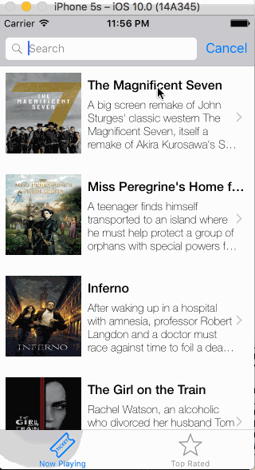

# codepath-flicks

**Movies App** is a movies app using the [The Movie Database API](http://docs.themoviedb.apiary.io/#).

Time spent: **7** hours spent in total

## User Stories

The following **required** functionality is completed:

- [x] User can view a list of movies currently playing in theaters. Poster images load asynchronously.
- [x] User can view movie details by tapping on a cell.
- [x] User sees loading state while waiting for the API.
- [x] User sees an error message when there is a network error.
- [x] User can pull to refresh the movie list.

The following **optional** features are implemented:

- [x] Add a tab bar for **Now Playing** and **Top Rated** movies.
- [x] Add a search bar.
- [x] All images fade in.

## Video Walkthrough 

Here's a walkthrough of implemented user stories:

GIF created with [LiceCap](http://www.cockos.com/licecap/).

## Notes

It was pretty straight forward but I had alot of trouble integrating and testing the networking element. My internet is also pretty fast so it was hard to tell if the pull to refresh was working. It was also hard to shut off the internet to check if the app would error out because then the stimulator didn't want to load.

## License

    Copyright [2016] [Shola Oyedele]

    Licensed under the Apache License, Version 2.0 (the "License");
    you may not use this file except in compliance with the License.
    You may obtain a copy of the License at

        http://www.apache.org/licenses/LICENSE-2.0

    Unless required by applicable law or agreed to in writing, software
    distributed under the License is distributed on an "AS IS" BASIS,
    WITHOUT WARRANTIES OR CONDITIONS OF ANY KIND, either express or implied.
    See the License for the specific language governing permissions and
    limitations under the License.
    
    
